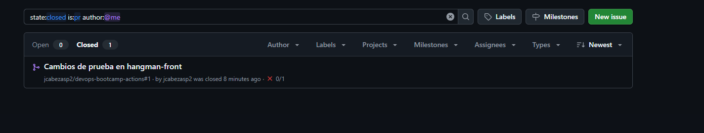
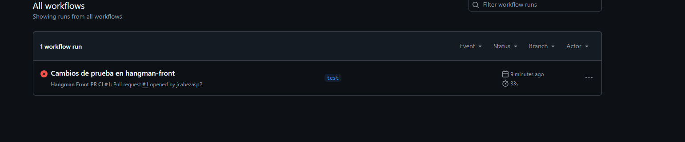
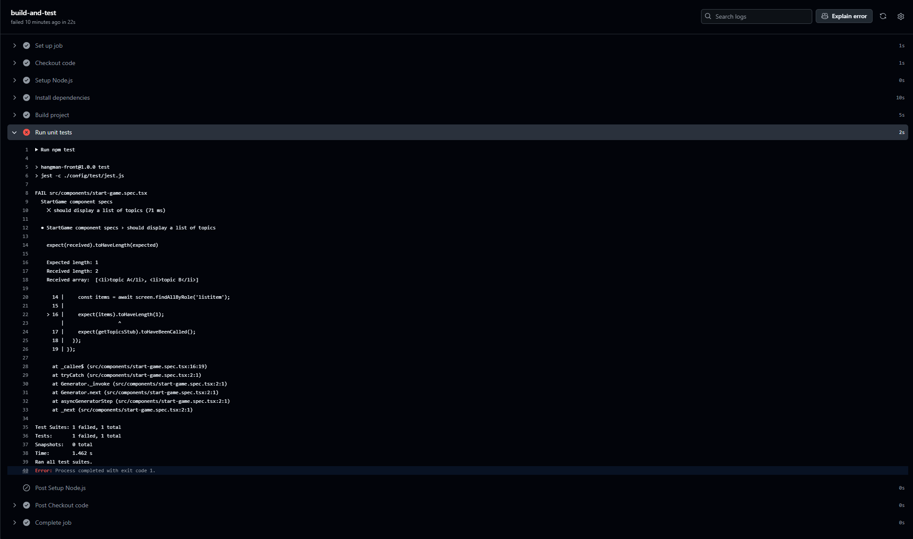

# Workflow CI para el proyecto de Frontend

## Repositorio

El código fuente del frontend se encuentra en el siguiente repositorio de GitHub:  
[https://github.com/jcabezasp2/devops-bootcamp-actions](https://github.com/jcabezasp2/devops-bootcamp-actions)  
El contenido del proyecto `hangman-front` fue copiado y subido a la rama `main`.

## Configuración del Workflow

Se ha creado un workflow de **GitHub Actions** para el proyecto de frontend.  
Este workflow se encarga de:
- Compilar el proyecto
- Ejecutar las pruebas unitarias

## Ejecución del Workflow

Para probar el workflow, se realizó una **pull request**:

El workflow se ejecutó automáticamente al crear la pull request.  
Puedes consultar el resultado de la ejecución en la pestaña **Actions** del repositorio:

## Resultados de la Ejecución

A continuación se muestra el resultado de la ejecución del workflow:

