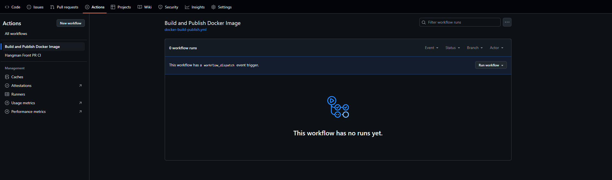
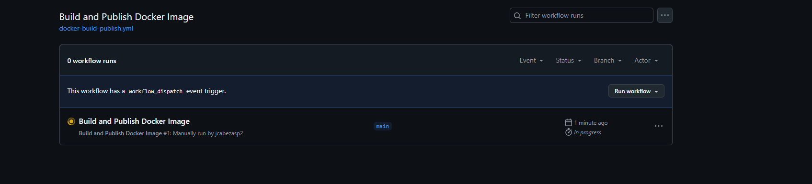
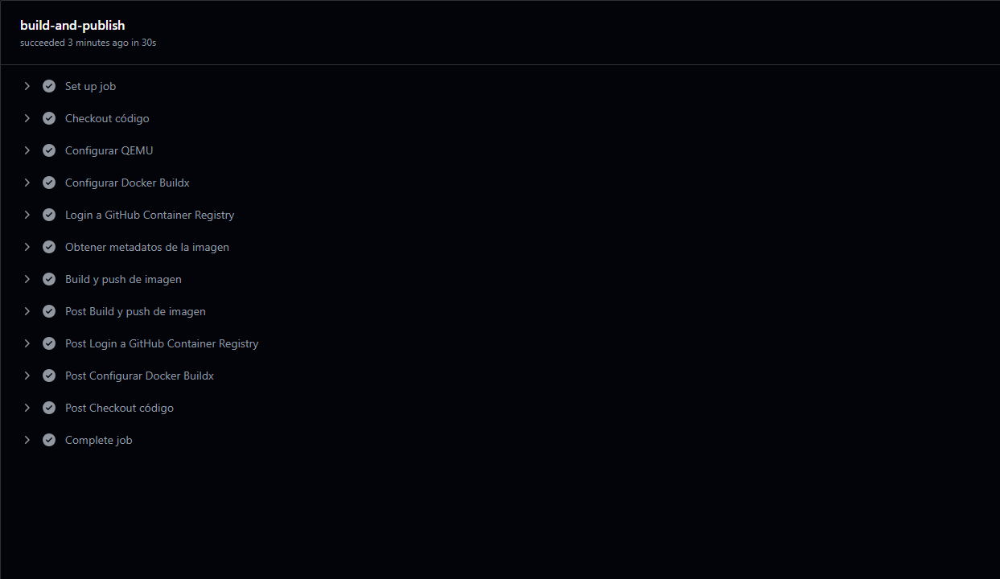

# Workflow CD para el proyecto de Frontend

## Descripción

Se ha creado un workflow de **GitHub Actions** para el proyecto de frontend.  
Este workflow automatiza la construcción y publicación de la imagen Docker del frontend en el **GitHub Container Registry**.

---

## Ejecución del Workflow

El workflow aparece en la pestaña **Actions** del repositorio:

Por defecto, la imagen se construye y publica con el tag `latest`, aunque es posible cambiar el tag según la configuración del workflow:

---

## Creación y publicación de la imagen

Al ejecutarse el workflow, se crea una imagen Docker del frontend:

---

## Visualización en GitHub Container Registry

La imagen generada puede ser consultada en el **GitHub Container Registry** asociado al repositorio:

