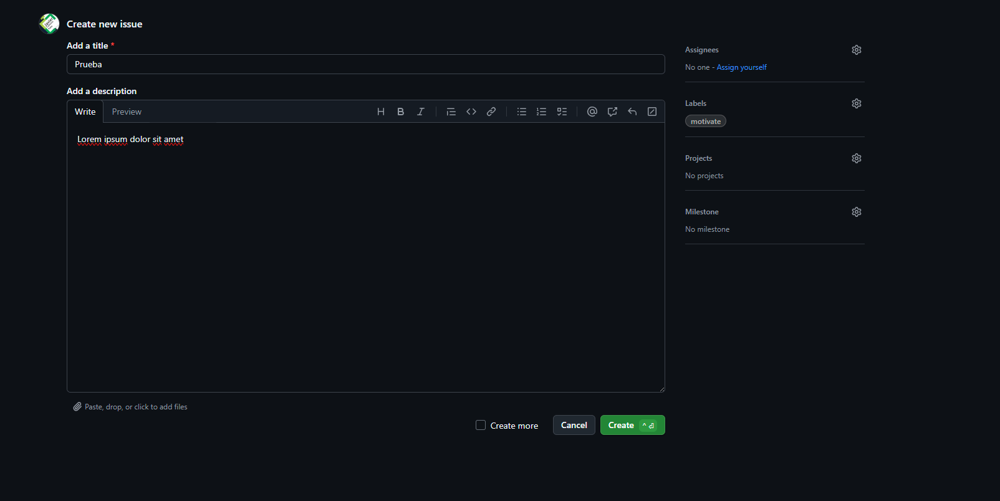
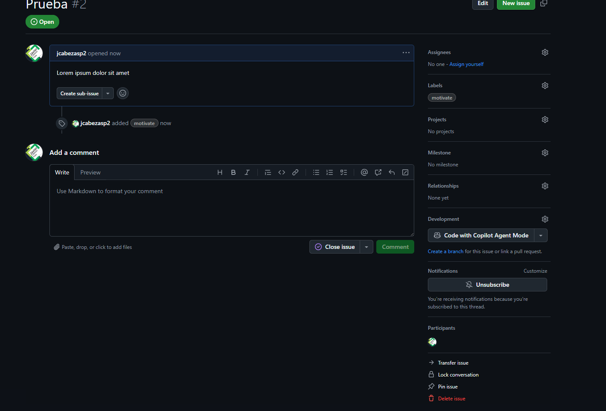
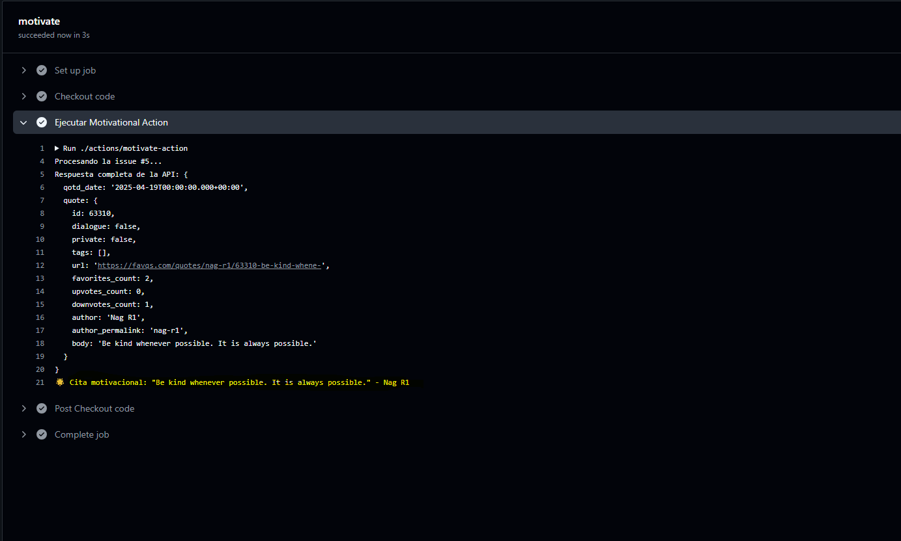

# Automatización de mensajes motivacionales con GitHub Actions

## Descripción

Este workflow de **GitHub Actions** está configurado para detectar la creación de una issue con la etiqueta `motivate`.  
Cuando esto ocurre, el workflow publica un mensaje motivacional en los logs de la ejecución.

---

## Ejemplo de uso

1. **Creación de una issue con la etiqueta `motivate`:**

   
   

2. **Resultado en los logs del workflow:**

   Al ejecutarse el workflow, se puede ver el mensaje motivacional en los logs:

   

