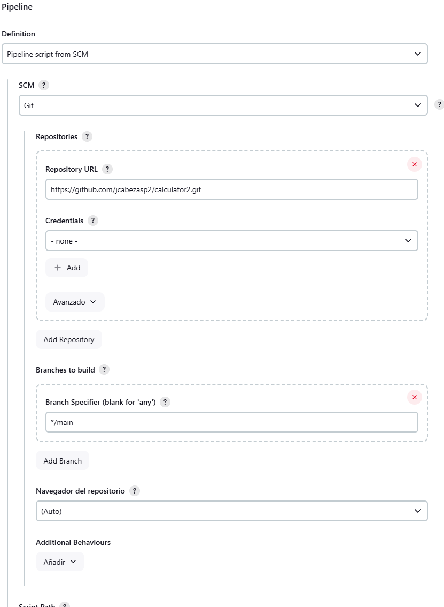
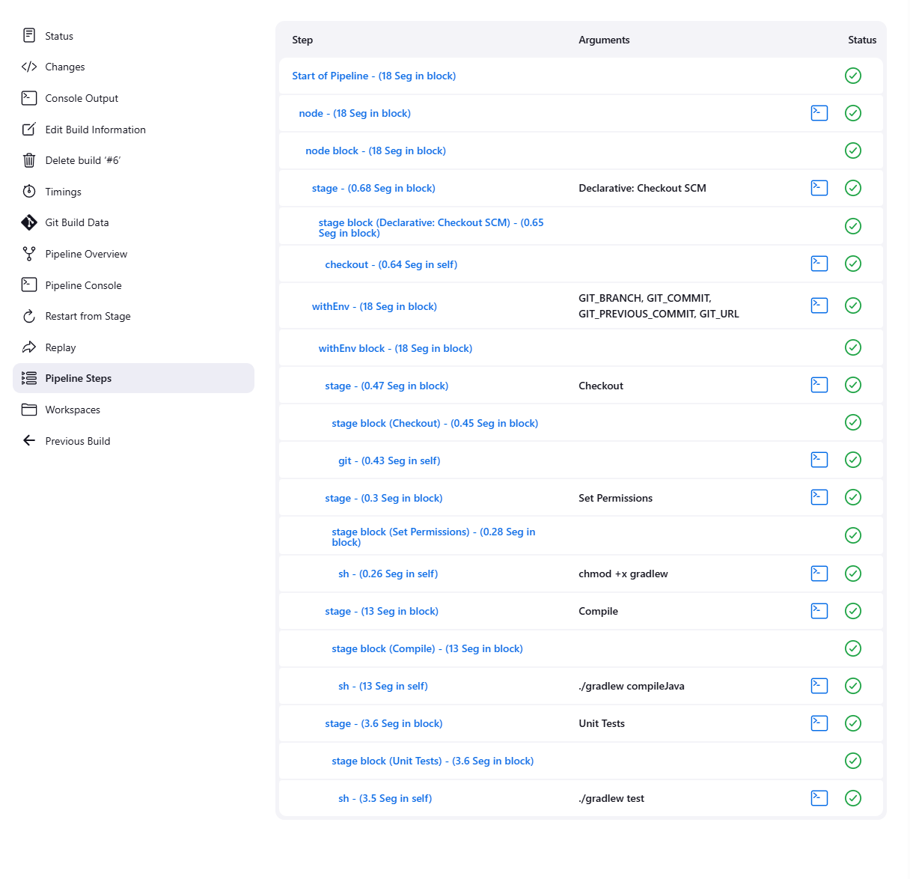

# Bootcamp DevOps - Módulo 4: CI/CD
### Ejercicio 1

Para este ejercicio se ha creado un repositorio en Github con la siguiente direccion:
https://github.com/jcabezasp2/calculator2.git

### Configuración de pipeline en Jenkins

### Prueba de ejecución del jenkinsfile

